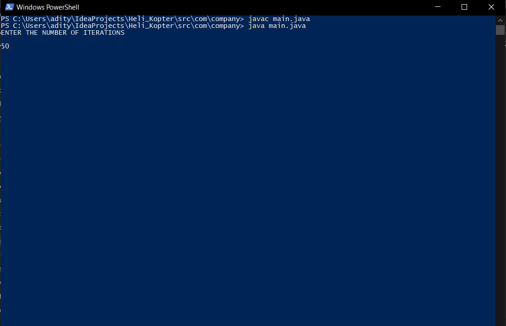
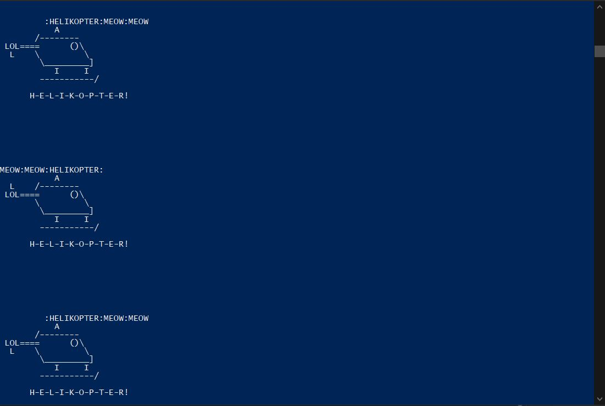

# Heli-Kopter-JAVA-CODE

<h1>INSTRUCTIONS</h1>

<h2>Download Main.java Then compile the code by using following command:-  <b>javac main.java</b> <b>java main.java</b>  AFTER THEN JUST GIVE THE NUMBER OF TIMES YOU WANT TO RUN THE LOOP</h2>

<h2>OUTPUT</h2>

<h3>HeliKopter MEME - https://www.youtube.com/watch?v=a0DbzUe-r4Q</h3>
